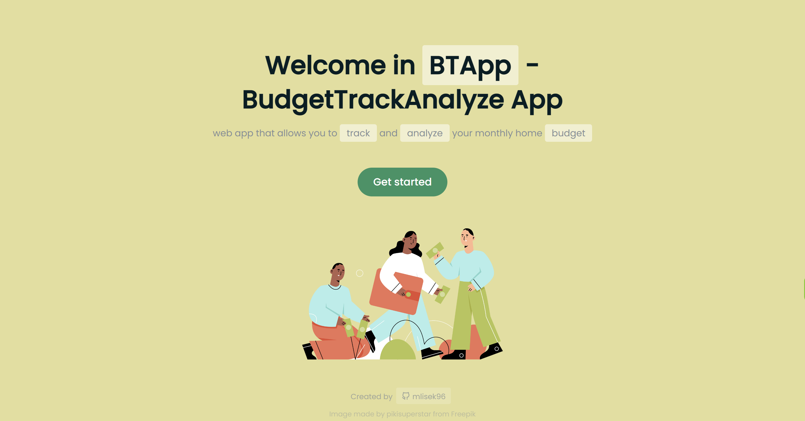

# Welcome to BTAapp!

🎨full title: BudgetTrackAnalyze App

 **APP CONCEPT:** A web application that allows you to budget, track and analyze your expenses, with options to categorize and present expenditures in appropriate time periods.

## 🦊 DEMO

> 👨‍💻 still working on it... trying to improve development of the app

Click the link and check webpage: https://mlisek96.github.io/BTApp/

**Happy budgeting!** 💰
**Happy tracking!** 🔍
**Happy analyzing!** 📊
**Hope you would like it!** 🫶

## 📓 TECHNOLOGIES

* React.js with Hooks, Context, BrowserRouter, Links and more
* SASS
* LocalStorage
* Vite
* Mantaine library

## 📦 QUICK PROJECT REVIEW

* #### Hero Page:
  Which you can see above contain welcoming, started button, pic and page-footer(copyrights and link to my GitHub profile)

* #### LogIn Page:
  include login form, with created validation thanks to using state of the component

* #### Home Page:
  contain budget analyze with rings progress (one in total, second by category), expenses table and calendar

* #### Add Expenses Form:
  from contain: amount input, description input, category select, month select

* #### Expenses Table:
  contain two tables with options to categorize and present expenditures in appropriate time periods (monthly)

* #### 404 Page:
  contain short description and button to hero/home page, depends on login validation

## 💾 INSTALLATION

1) git clone https://github.com/mlisek96/BTApp.git
2) npm install
3) npm run dev
## 👮‍♂️ LICENSE

See the [LICENSE](LICENSE) file for license rights and limitations (MIT).

## ☎️ CONTACT

In case of any comments or advice please contact with me by Issues :)